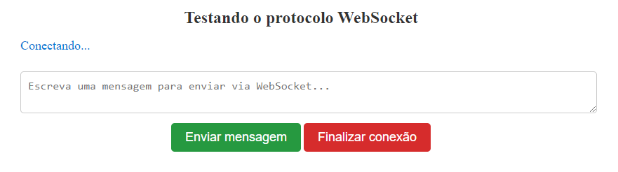
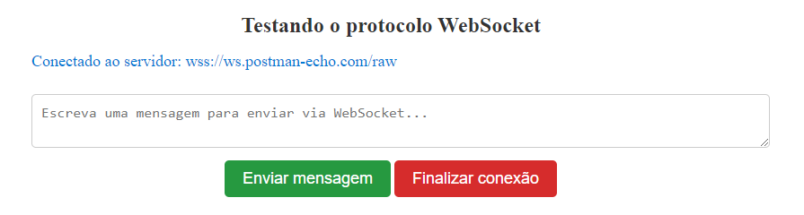
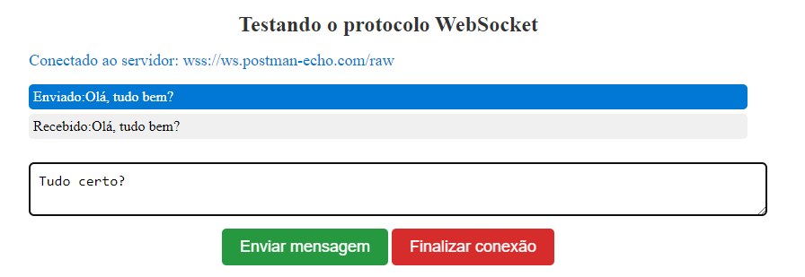
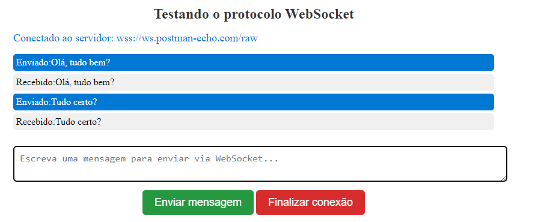
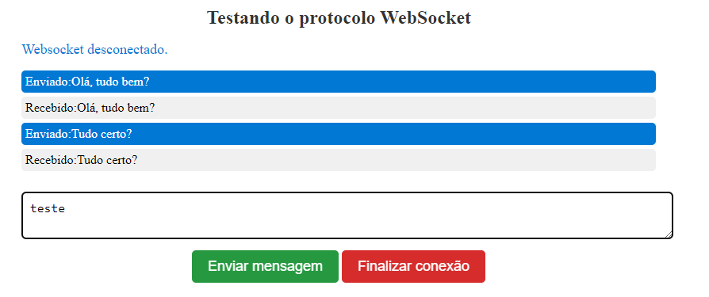
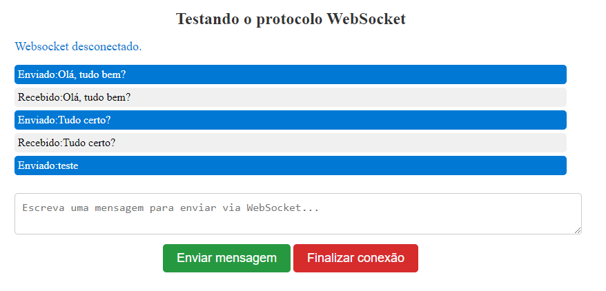

# WebSocket

É um protocolo de comunicação bidirecional baseado em TCP que permite a comunicação em tempo real entre um navegador da web e um servidor. Diferentemente do HTTP, que é um protocolo de solicitação e resposta, o WebSocket permite que os dados fluam em ambas as direções de forma simultânea, sem a necessidade de uma nova solicitação de conexão a cada interação.

A principal vantagem do WebSocket é a capacidade de estabelecer uma conexão persistente e interativa entre o cliente (geralmente um navegador da web) e o servidor. Isso é especialmente útil para aplicativos que exigem atualizações em tempo real, como bate-papo, jogos on-line, aplicativos de colaboração, feeds de notícias ao vivo e outras aplicações interativas na web.

Aqui estão algumas características importantes do WebSocket:

- Comunicação Bidirecional: O WebSocket permite a comunicação bidirecional em tempo real, o que significa que tanto o cliente quanto o servidor podem enviar e receber dados simultaneamente.
- Baixa Latência: O WebSocket oferece baixa latência, tornando-o adequado para aplicativos que exigem atualizações rápidas e em tempo real.
- Conexão Persistente: A conexão WebSocket permanece aberta após a sua criação inicial, o que elimina a necessidade de abrir uma nova conexão para cada interação, reduzindo a sobrecarga de comunicação.
- Protocolo Web: O WebSocket é um protocolo da Web e é suportado por todos os principais navegadores da web, tornando-o amplamente utilizado na criação de aplicativos da web em tempo real.

Para usar o WebSocket em seu aplicativo, você pode utilizar APIs JavaScript no lado do cliente para estabelecer e gerenciar a conexão WebSocket. No lado do servidor, existem bibliotecas e frameworks em várias linguagens de programação que permitem implementar a lógica do servidor WebSocket.

Em resumo, o WebSocket é uma tecnologia poderosa para a criação de aplicativos web em tempo real e interativos, permitindo uma comunicação eficiente e de baixa latência entre o navegador e o servidor.

# Aplicação WebSocket

Será mostrado a seguir a funcionalidade da aplicação construída, que é um exemplo de uma aplicação web que utiliza o protocolo WebSocket para demonstrar a comunicação em tempo real entre um cliente (navegador) e um servidor.

Em resumo a aplicação faz:

- **Página HTML:** A página HTML contém elementos para entrada e exibição de mensagens. Há um campo de entrada de mensagem, um botão para enviar a mensagem, um botão para fechar a conexão e uma área onde as mensagens são exibidas.
- **WebSocket:** A aplicação cria uma conexão WebSocket para um servidor em **"wss://ws.postman-echo.com/raw"**. Esta é a parte do cliente que permite a comunicação em tempo real.
- **Status da Conexão:** O aplicativo exibe um status de conexão na página, informando se está **"Conectando..."* quando a conexão está sendo estabelecida ou **"Websocket desconectado."** quando a conexão é fechada.
- **Enviar Mensagens:** Os usuários podem digitar mensagens no campo de texto e clicar no botão "Enviar mensagem" para enviar a mensagem para o servidor por meio da conexão WebSocket.
- **Exibir Mensagens:** As mensagens enviadas pelo servidor ou pelo cliente são exibidas em uma lista na página HTML. As mensagens são identificadas como **"Recebido"** ou **"Enviado"** para mostrar a direção da mensagem.
- **Fechar Conexão:** Os usuários podem fechar a conexão WebSocket clicando no botão **"Finalizar conexão"**.

No geral, esta aplicação serve como um exemplo simples de como implementar uma comunicação em tempo real entre um navegador e um servidor usando o protocolo WebSocket. Ela demonstra como criar uma conexão WebSocket, enviar mensagens e lidar com eventos de abertura, recebimento e fechamento de conexão. É uma base útil para entender a comunicação em tempo real em aplicativos da web.

##### A seguir é mostrado exemplos evidenciando a dinâmica da comunicação WebSocket

